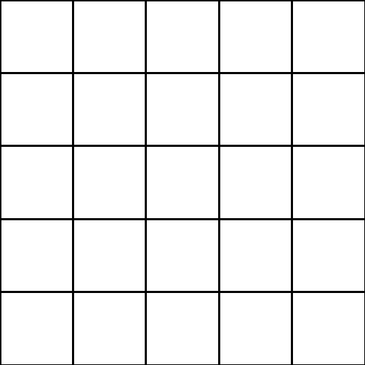
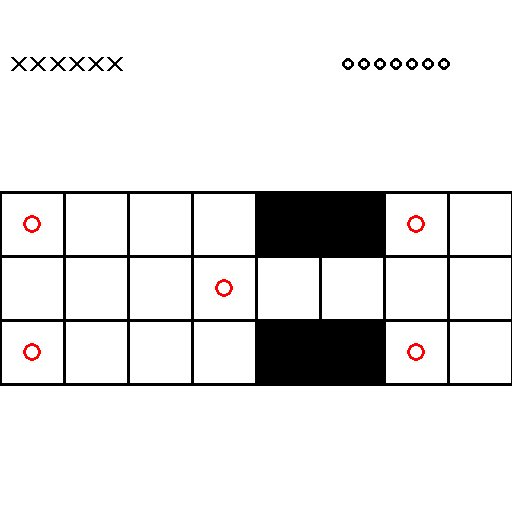

# RL-games

A repository where I will be uploading games that I have implemented using OpenAI's Gymnasium and Reinforcement Learning-based algorithms that play them. Google Colab GPUs were used to train the models.

## Games

### N-Tic-Tac-Toe

The first game I implemented was N-Tic-Tac-Toe (N being the size of the board). I used a Temporal Difference algorithm with a Deep Q-Network to approximate the $Q$-function. The agent learns to play against itself as it plays 5000 games (episodes). 

### Royal Game of Ur (RoGoU)

Most games used in these toy examples tend to come from a handful of games that are seen as the "Hello World" of Reinforcement Learning. I wanted to try something different and decided to implement the Royal Game of Ur. It is a game that was played in Mesopotamia around 2500 BC and has fallen into obscurity (granted, there has been a [recent emergence](https://www.youtube.com/watch?v=WZskjLq040I&ab_channel=TheBritishMuseum)). The rules of the game can be found [here](https://royalur.net/rules).

The algorithm used in this game is the same as the one used in Tic-Tac-Toe with some minor changes. In particular, the neural network was changed slightly and the train loop was modified so that the model presumes it's always Player 1. This is because the game is symmetric and the transformation done in the training loop alleviates the need for the model to understand it's playing as Player 1 or 2. Similarly, the agent learns to play against itself as it plays 5000 games (episodes).

